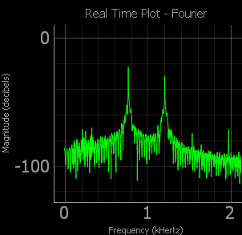
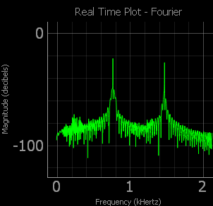

# lmmf_sound

## Sobre
A description of your project follows. A good description is clear, short, and to the point. Describe the importance of your project, and what it does.

## Indice
Optionally, include a table of contents in order to allow other people to quickly navigate especially long or detailed READMEs.

## Installation
Installation is the next section in an effective README. Tell other users how to install your project locally. Optionally, include a gif to make the process even more clear for other people.

## Usage
The next section is usage, in which you instruct other people on how to use your project after they’ve installed it. This would also be a good place to include screenshots of your project in action.

##Credits
Include a section for credits in order to highlight and link to the authors of your project.

##License
Finally, include a section for the license of your project. For more information on choosing a license, check out GitHub’s licensing guide!

 - http://patorjk.com/software/taag/
 - pyqtgraph
 - pyqt4
 - pyqt Designer
 - pyuic4 input.ui -o output.py
 - sounddevice
 - soundfile
 - numpy

 https://github.com/matplotlib/matplotlib/issues/6559
 https://github.com/swharden/Python-GUI-examples

 https://gist.github.com/endolith/250860

# Sinais de Fourier
| Fourier Transmitido | Fourier Recebido | Tom |
|------------|-------------|-------------|
|  |  | Tom 0       |
|  |  | Tom 1       |
|  |  | Tom 2       |
|  |  | Tom 3       |
|  |  | Tom 4       |
|  |  | Tom 5       |
|  |  | Tom 6       |
|  |  | Tom 7       |
|  |  | Tom 8       |
|  |  | Tom 9       |
|  |  | Tom #       |
|  |  | Tom *       |

Dado os sinais enviados, os sinais foram recebidos com certo ruído dado pelo microfone ou ambiente. A frequência detectada foi próxima da frequência do tom, tendo como variância 3. As frequências encontradas são registradas no console na hora da análise.

Na geração dos tons, foi utilizado um tempo de um segundo e na recepção também. Na recepção, quanto maior o tempo de gravação, maiores eram os ruídos e mais difícil era a detecção do som. A detecção do som não foi possível "em tempo real" somente num ambiente com ruídos controlados, em que o tom era gravado e depois passava por análise.
