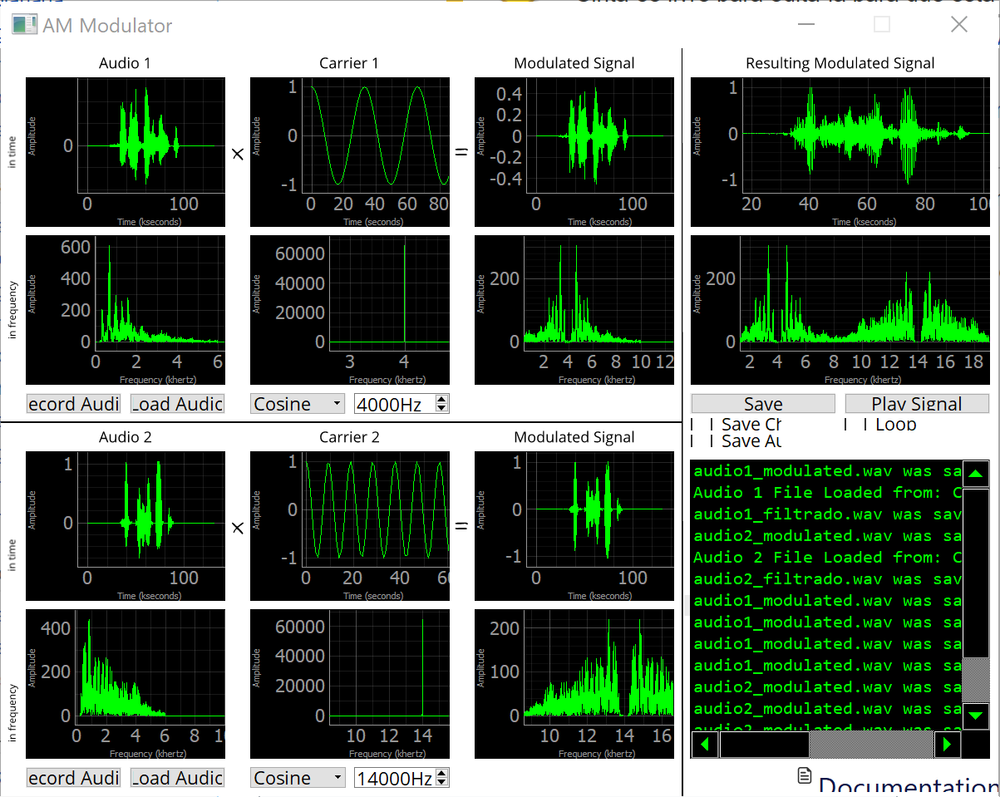

# Modulação
A modulação em amplitude (AM) é uma forma de modulação em que a amplitude de um sinal senoidal/cossenoidal varia em função do sinal principal.

Isto é, o sinal senoidal/cossenoidal é uma portadora (carry) que tem frequência e fase constantes. Multiplicando a portadora em função do sinal principal (de interesse), há a modulação da amplitude deste sinal. Com isso, o sinal resultante desloca-se no domínio da frequência, ocupando outra banda.

Essa propriedade permite que possamos transmitir mais de um sinal ao mesmo tempo e no mesmo meio, pois podemos transmitir diferentes sinais em frequências diferentes. Aplicando a demodulação no sinal resultante, conseguimos recuperar os sinais de interesse em suas respectivas frequências.

### No projeto:
- Primeiro foi aplicado um filtro passa baixa de (4kHz) nos áudios a serem transmitidos. Isso diminuiu a banda dos sinais e fez com que a alocação de banda deles fosse mais fácil, diminuindo a interferência que um aplica no outro.
- Posteriormente, os sinais a serem transmitidos foram multiplicados por portadoras de mesmo tamanho, sendo deslocados na frequência.
- Como os dois áudios deveriam ser mandados juntos, os dois áudios deslocados foram somados (tinham o mesmo tamanho) e transmitidos.

# Demodulação
A demodulação é o processo de recuperar o sinal original. Uma vez que aplicamos a modulação do estilo SC (supressed carrier), para retornar os dois sinais, bastou multiplicarmos o sinal transmitido pelas duas carrier utilizadas no transmissor.

### No projeto:
- Primeiro recuperamos o sinal transmitido através do microfone do computador (usamos o pacote `sounddevice`)
- Em seguida, definimos as mesmas funções portadoras usadas na modulação do áudio
- Multiplicamos o sinal recebido com cada uma das portadoras definidas. Devido a propriedades matemáticas, essa multiplicação resulta no sinal original.

# Frequências das portadoras utilizadas e bandas
As frequências das portadoras utilizadas foram 4kHz e 14kHZ, pois assim o sinal de um áudio não transpõem o sinal do outro áudio em outra banda. A banda ocupada pelo áudio 1 foi de 1kHz a 7kHz e a segunda banda, ocupada pelo segund áudio foi de 8kHz a 19kHz.

